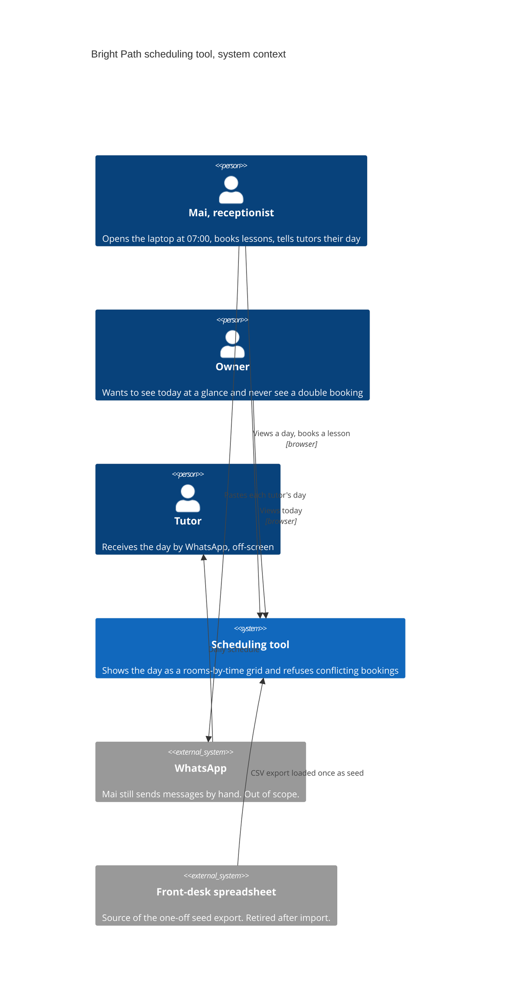
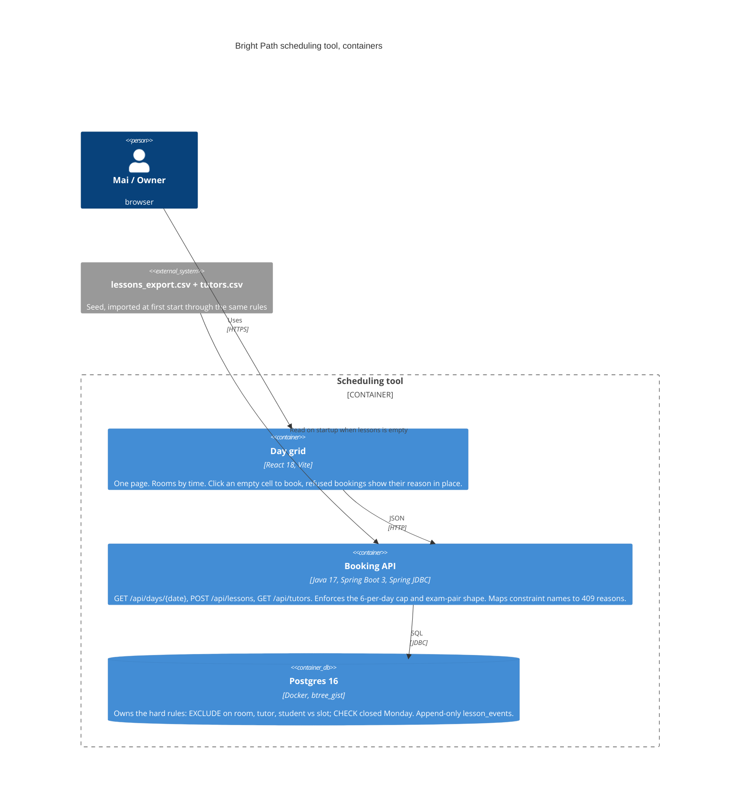
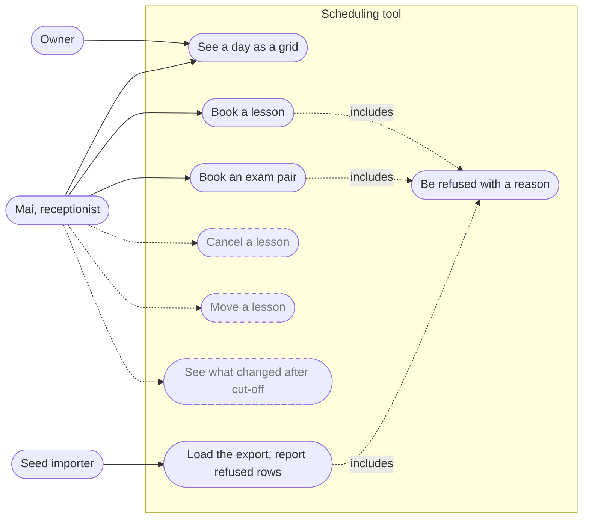
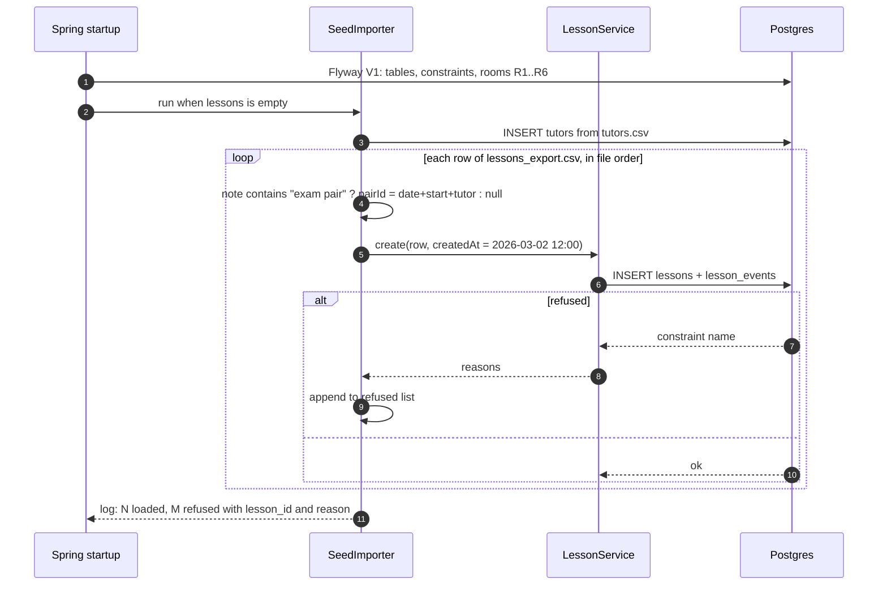

# Architecture

Diagrams are Mermaid. GitHub renders them inline.

## C4 level 1: system context



## C4 level 2: containers



## Use cases

Mermaid has no use-case diagram type, so this is a flowchart in use-case shape.
Solid edges are built. Dashed edges are in the data model but have no code or screen.



| Use case | Actor | Rules exercised | Built |
|---|---|---|---|
| See a day as a grid | Mai, Owner | none, read only | yes |
| Book a lesson | Mai | room, tutor, student overlap; closed Monday; 6 per day | yes |
| Book an exam pair | Mai | same, with `pair_id` exception; pair max 2, same tutor/room/slot | yes |
| Be refused with a reason | system | constraint name to reason mapping | yes |
| Load the export | importer | all of the above, first row wins | yes |
| Cancel a lesson | Mai | 4-hour rule, who cancelled, after_cutoff event | model only |
| Move a lesson | Mai | overlap rules again, after_cutoff event | model only |
| See what changed after cut-off | Mai | events where after_cutoff | model only |

## Sequence: book a lesson

```mermaid
sequenceDiagram
  autonumber
  actor Mai
  participant Web as Day grid (React)
  participant API as Booking API (Spring)
  participant DB as Postgres

  Mai->>Web: click empty cell (room R1, 14:30)
  Web->>Mai: form: student, tutor, duration, exam pair?
  Mai->>Web: submit
  Web->>API: POST /api/lessons {date, start, duration, student, tutorId, roomId, pairId?}
  API->>DB: SELECT count of distinct bookings for tutor on date (pair counts once)
  DB-->>API: n
  alt n >= 6
    API-->>Web: 409 {reasons: ["tutor T1 already has 6 bookings on 2026-03-06"]}
  else
    API->>DB: BEGIN; INSERT INTO lessons ...; INSERT INTO lesson_events (created); COMMIT
    alt constraint violated
      DB-->>API: 23P01 exclusion / 23514 check, constraint name
      API->>API: map name to reason (room busy, tutor busy, student busy, closed Monday)
      API-->>Web: 409 {reasons: [...]}
    else
      DB-->>API: ok
      API-->>Web: 201 {lesson}
    end
  end
  Web->>API: GET /api/days/2026-03-06
  API->>DB: SELECT lessons for date, join tutors
  DB-->>API: rows
  API-->>Web: {rooms: [{id, lessons: [...]}]}
  Web-->>Mai: grid redrawn, refused booking shows its reason in the cell
```

## Sequence: seed import on first start



Expected refusals from the seed week, given first row wins:

| Row | Reason |
|---|---|
| L008 | student Le Minh Chau already in R3 with T3 at 09:00 (L007 wins) |
| L027 | tutor T1 already has 6 bookings on 2026-03-06 |
| L032 | 2026-03-09 is a Monday, the centre is closed |
| L034 | tutor T1 already in R1 at 09:00 (L033 wins) |

L009 and L010 load as one exam pair. L005 and L017 load as cancelled and take no room or tutor slot.
